# T18 BombApetit Read Me

<!-- this is an instruction line; after you follow the instruction, delete the corresponding line. Do the same for all instruction lines! -->

## Team

| Number | Name              | User                             | E-mail                                                |
| -------|-------------------|----------------------------------| ------------------------------------------------------|
| 99102  |   Manuel Albino   | <https://github.com/bin0o>       | <mailto:manuel.albino@tecnico.ulisboa.pt>             |
| 99077  |  Guilherme Lima   | <https://github.com/GLima727>    | <mailto:guilhermegutierrez727@tecnico.ulisboa.pt>     |
| 99125  |   Tiago Caldas    | <https://github.com/caldas479>   | <mailto:tiago.rodrigues.caldas@tecnico.ulisboa.pt>    |

  

## Contents

This repository contains documentation and source code for the *Network and Computer Security (SIRS)* project.

The [REPORT](REPORT.md) document provides a detailed overview of the key technical decisions and various components of the implemented project.
It offers insights into the rationale behind these choices, the project's architecture, and the impact of these decisions on the overall functionality and performance of the system.

This document presents installation and demonstration instructions.

## Installation

To see the project in action, it is necessary to setup a virtual environment, with 3 networks and 4 machines.  

The following diagram shows the networks and machines:

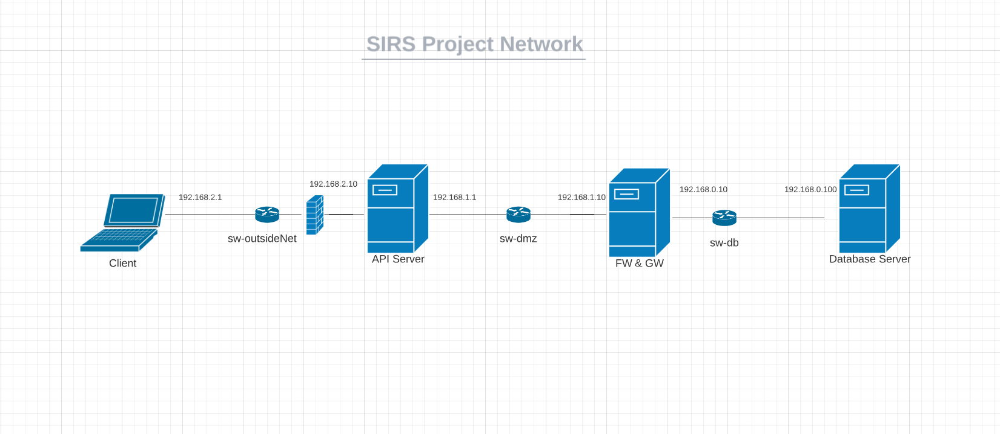

### Prerequisites

All the virtual machines are based on: Linux 64-bit, Kali 2023.3  

[Download](https://www.virtualbox.org/wiki/Downloads) and [install](https://www.kali.org/docs/virtualization/install-virtualbox-guest-vm/) a virtual machine of Kali Linux 2023.3.  

We strongly recommend downloading the kali [VirtualBox](https://www.kali.org/docs/virtualization/import-premade-virtualbox/) by getting a premade [Image](https://www.kali.org/get-kali/#kali-virtual-machines).
### Machine configurations

Inside the machine you just downloaded, use Git to obtain the code.

```sh
$ git clone https://github.com/tecnico-sec/t18-tiago-manuel-guilherme
```

Besides cloning the repository we will also require some packages.
```sh
$ sudo apt update
$ sudo apt install ufw
$ pip install -r requirements.txt
```

After this is done, we can start cloning and creating other Virtual Machines, one for the API, other for the Database, the FW & GW and finally one for the Client.
Next we have custom instructions for each machine.

#### Overview of the Virtual Machines Network

To create each machine, you will have to clone the previous one. Choose the option Generate New Mac addresses for all network adapters, after the Linked clone.

Change the names of the 4 VMS to VM-DB, VM-FW&GW, VM-API, VM-CLIENT.

We are assuming that:

- VM-DB has an interface `eth0` (connected to `sw-db`).

- VM-FW&GW has interfaces `eth0` (connected to `sw-db`) and `eth1` (connected to `sw-dmz`).

- VM-Client has an interface `eth0` (connected to `sw-outsideNet`).

- VM-API has interfaces `eth0` (connected to `sw-dmz`) and `eth1` (connected to `sw-outsideNet`).


#### Machine 1 - VM API

This machine runs the Server API.

This machine will be running Flask 3.0.0.

To verify:

```sh
$ sudo ifconfig eth0 192.168.1.1/24 up
$ sudo ifconfig eth1 192.168.2.10/24 up
$ sudo ip route add default via 192.168.1.10
```

You will also have to change the interfaces to make these changes permanent
```sh
$ sudo nano /etc/network/interfaces
```

Replace existing file for the following text.

```plaintext
# This file describes the network interfaces available on your system
# and how to activate them. For more information, see interfaces(5).


source /etc/network/interfaces.d/*

# The loopback network interface and sw-1 interface
auto lo eth0 eth1       
iface lo inet loopback

# sw-dmz interface
iface eth0 inet static      
        address 192.168.1.1 
        netmask 255.255.255.0
        gateway 192.168.1.10

# sw-outsideNet interface  
iface eth1 inet static   
        address 192.168.2.10 
        netmask 255.255.255.0 
```
#####To setup the firewall of the API VM:
```sh
$ sudo ufw default deny incoming
$ sudo ufw default deny outgoing
```
Allow incoming HTTPS traffic on eth1:
```sh
$ sudo ufw allow in on eth1 to any port 443
```

Allow outgoing HTTPS traffic on eth1:
```sh
sudo ufw allow out on eth1 to any port 443
```
Allow incoming traffic from 192.168.0.100:
```sh
sudo ufw allow in from 192.168.0.100
```
Allow outgoing traffic to 192.168.0.100:
```sh
sudo ufw allow out to 192.168.0.100
```
And finally:
```sh
sudo ufw enable
```
To test, only run this after all VMs have been configured and make sure that you run the Database commands first:

```sh
$ cd src
$ flask run -h 192.168.2.10 -p 443 --cert=ssl/server.crt --key=ssl/server.key
```
The expected results are a flask server running.

#### Machine 2 - VM DB

This machine runs the Database Server

This machine will be running a database server (PostgreSQL 16).
To verify:

```sh
$ sudo ifconfig eth0 192.168.0.100/24 up
$ sudo ip route add default via 192.168.0.10
```

You will also have to change the interfaces to make these changes permanent
```sh
$ sudo nano /etc/network/interfaces
```

Replace existing file for the following text.

```plaintext
# This file describes the network interfaces available on your system
# and how to activate them. For more information, see interfaces(5).


source /etc/network/interfaces.d/*

# The loopback network interface and sw interface
auto lo eth0      
iface lo inet loopback

# sw-db interface
iface eth0 inet static      
        address 192.168.0.100 
        netmask 255.255.255.0
        gateway 192.168.0.10 
```

To Setup the rest of the database VM follow the steps in the guide [Database_Setup.md](Database_Setup.md).

To test, only run this after all VMs have been configured and make sure you run this before you run the application:

```sh
$ cd src 
$ python3 clear_db.py
$ python3 init_db.py
```
The expected results are a populated database.

If you want to access the database you can run:
```sh
$ sudo -u postgres psql -d bombappetit
```
And inside postgres to see for example all users you can run the following query:
```sh
SELECT * FROM users_info; 
```
#### Machine 3 - VM Client

This machine runs the Client 

This machine will be running Python3.

To verify:

```sh
$ sudo ifconfig eth0 192.168.2.1/24 up
```

You will also have to change the interfaces to make these changes permanent
```sh
$ sudo nano /etc/network/interfaces
```

Replace existing file for the following text.

```plaintext
# This file describes the network interfaces available on your system
# and how to activate them. For more information, see interfaces(5).


source /etc/network/interfaces.d/*

# The loopback network interface and sw interface
auto lo eth0      
iface lo inet loopback

# sw-outsideNet interface
iface eth0 inet static      
        address 192.168.2.1
        netmask 255.255.255.0
```

To test, only run this after all VMs have been configured:

```sh
$ cd src 
$ python3 cli.py
```
If the error ahead occurs    
```sh
from collections import Mapping
ImportError: cannot import name 'Mapping' from 'collections' (/usr/lib/python3.11/collections/__init__.py)
The expected result is a CLI asking for a Username.
```
go to `File "/home/kali/.local/lib/python3.11/site-packages/prompt_toolkit/styles/from_dict.py"` 
and change the import line to

```sh
from collections.abc import Mapping
```

If everything works correctly the CLI shoud ask your Username.

#### Machine 4 - VM FW&GW

This machine runs the Firewall and is the Gateway between the DMZ network and the Database.


To verify:
```sh
$ sudo ifconfig eth0 192.168.0.10/24 up
$ sudo ifconfig eth1 192.168.1.10/24 up
```
You will have to change the interfaces and system configs to make these changes permanent.
```sh
$ sudo nano /etc/network/interfaces
```
Replace existing file for the following text.
```plaintext
# This file describes the network interfaces available on your system
# and how to activate them. For more information, see interfaces(5).


source /etc/network/interfaces.d/*

# The loopback network interface and sw interface
auto lo eth0 eth1    
iface lo inet loopback

# sw-db interface
iface eth0 inet static      
        address 192.168.0.10
        netmask 255.255.255.0

# sw-dmz interface  
iface eth1 inet static   
        address 192.168.1.10 
        netmask 255.255.255.0 
```

Run the following command:
```sh
$ sudo sysctl net.ipv4.ip_forward=1
```


You will have to open sysctl.conf with a text editor to make the changes permanent
```sh
$ sudo nano /etc/sysctl.conf
```

Uncomment the following line
```plaintext
net.ipv4.ip_forward=1
```

To make the `iptables` rules persistent, install (select "yes" to save the current rules):

```sh
$ sudo apt install iptables-persistent
```

To save the current `iptables` rules, do:

```sh
# FOR IPv4
$ sudo sh -c 'iptables-save > /etc/iptables/rules.v4'
# FOR IPv6
$ sudo sh -c 'ip6tables-save > /etc/iptables/rules.v6'
```

To automatically apply the saved `iptables` rules on boot, you need to enable the `netfilter-persistent.service`. Run the following command:

```sh
$ sudo systemctl enable netfilter-persistent.service
```

## Demonstration

Now that all the networks and machines are up and running, we can first of all start the Database.
In the DB VM, run these commands:
```sh
$ cd src 
$ python3 clear_db.py
$ python3 init_db.py
```

After this is done make sure you start the flask app in the API VM:
```sh
$ cd src
$ flask run -h 192.168.2.10 -p 443 --cert=ssl/server.crt --key=ssl/server.key
```

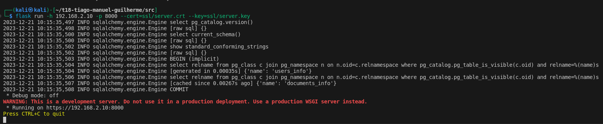

Now please run the client in the Client VM:
```sh
$ cd src
$ python3 cli.py
```
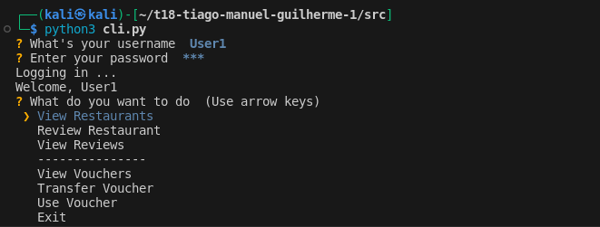

After logging in the User is able to View all Restaurants, review them, view the reviews on each Restaurant.
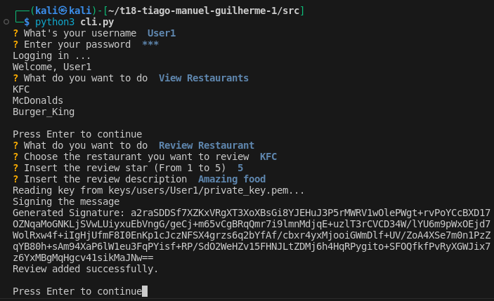
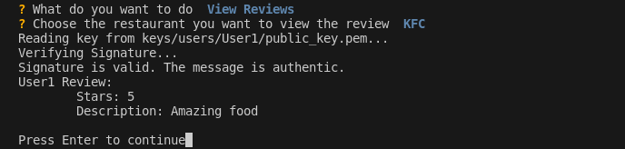

The User is also able to view the vouchers, use them or transfer them to another User.

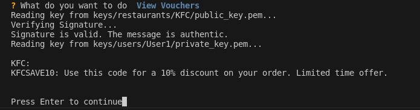
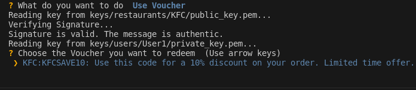

If the User1 wishes to transfer one of its vouchers to User2 the following will happen. After this User1 loses the voucher it transfers and User2 obtains it.
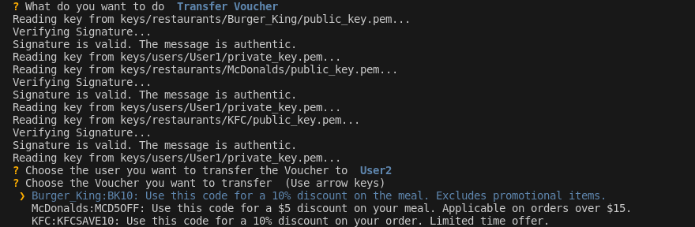


All data is encrypted when communicating between VMs.
In the following image, the FW&GW VM is running wireshark after a User has just logged in.
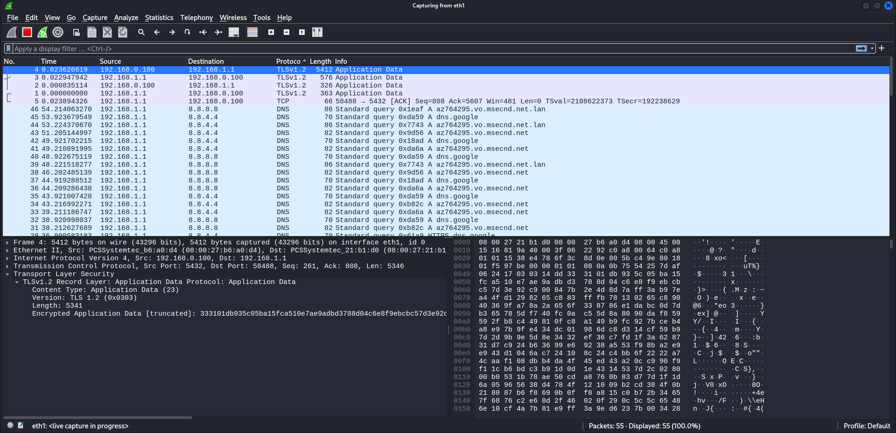
As we can see the data is sent through secure channels.

We tested running wireshark on the API VM to verify the difference between using https on flask and running http.

When using https this is what happens when a User logs in:
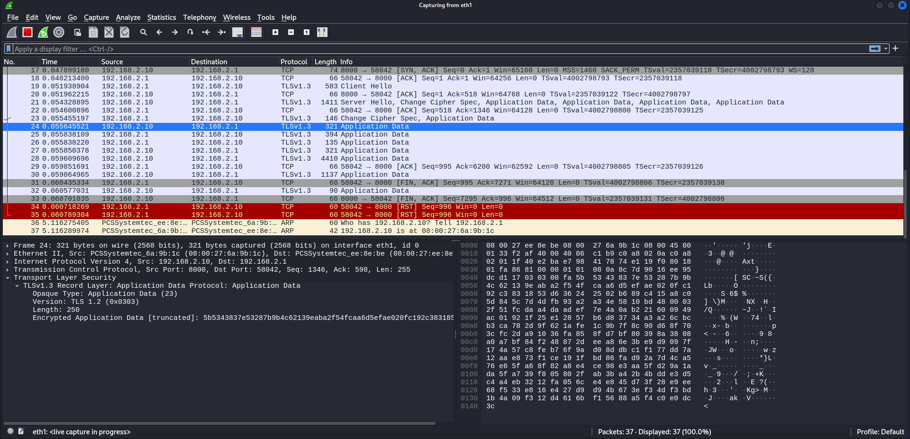
As we can see the data is secure and encrypted. Now let's check with http:
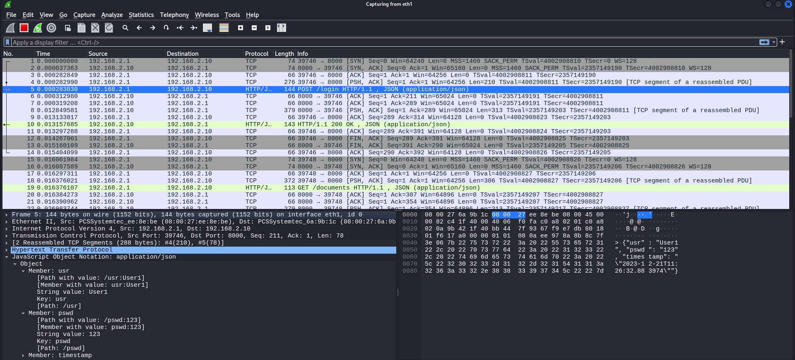
Now we get to see the exact username, password and timestamp of the User.

This concludes the demonstration.

## Additional Information

### Links to Used Tools and Libraries

- [Flask](https://flask.palletsprojects.com/en/3.0.x/)
- [SQLalchemy](https://www.sqlalchemy.org/)
- ...

### Versioning

We use a `requirements.txt` file for versioning.  
To download all requirements use:
```sh
pip install -r requirements.txt
```

### License

This project is licensed under the MIT License - see the [LICENSE.txt](LICENSE.txt) for details.

----
END OF README
